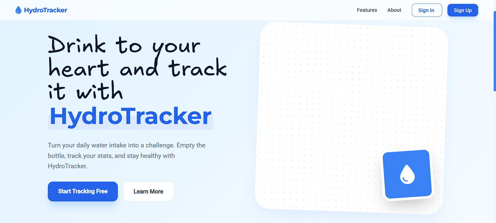
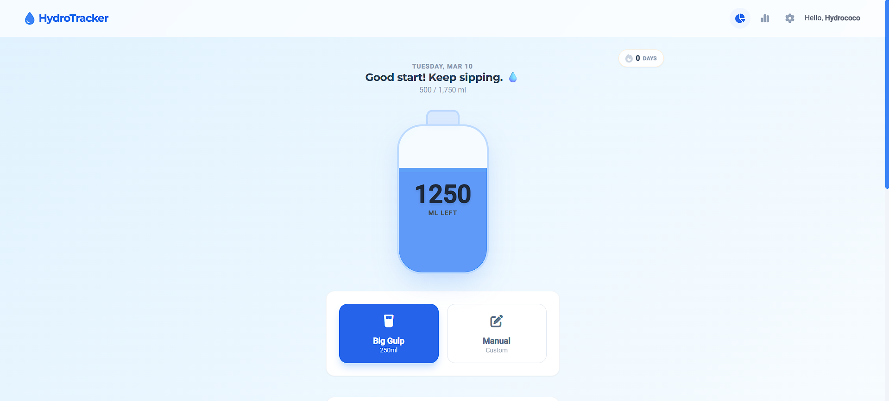
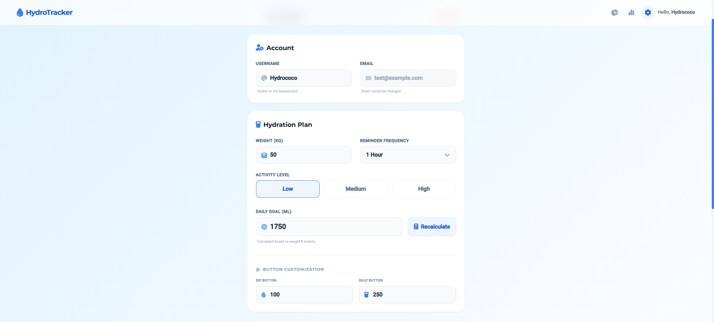
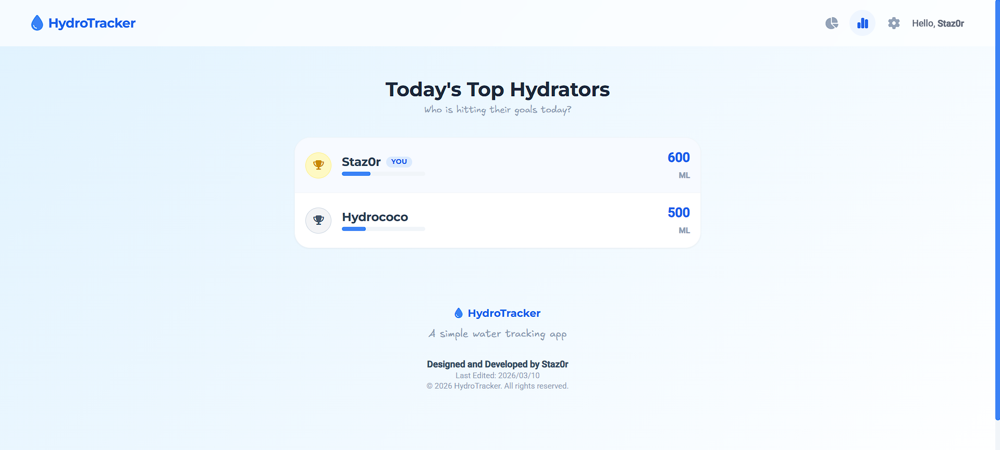
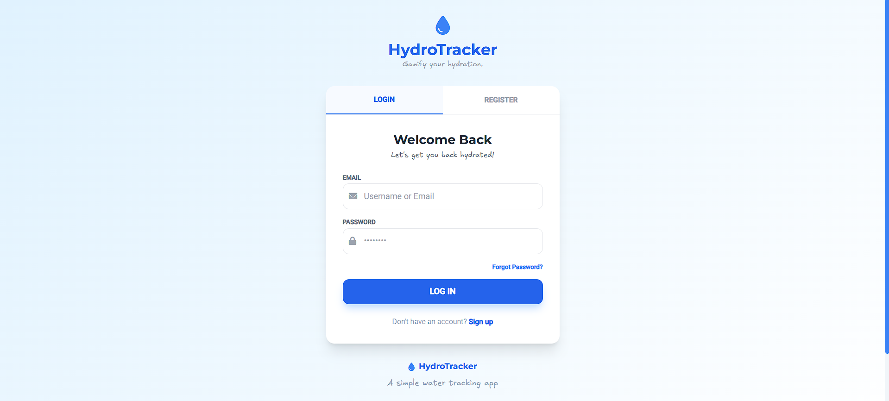

# HydroTracker

HydroTracker is a PHP + MySQL web app that turns daily water intake into a simple, gamified habit. Users set a personal hydration goal, log sips or gulps, build streaks, and view daily stats in a clean dashboard.

## Features

- Account registration and login
- Personal daily goal setup and reminders
- Quick log buttons (sip, gulp, custom amount)
- Streak tracking and daily history view
- Leaderboard and stats
- Responsive, Tailwind-powered UI
- Live dashboard updates (AJAX)

## Screenshots



| Home | Personalization |
| --- | --- |
|  |  |

| Leaderboard | Login |
| --- | --- |
|  |  |

## Tech Stack

- PHP
- MySQL
- Tailwind CSS (CDN)
- JavaScript

## Project Structure

- `index.php` - Landing page
- `login.php` - Login and registration UI
- `dashboard.php` - Main hydration dashboard
- `personalization.php` - User goal setup
- `actions/` - Form handlers and API-like endpoints
- `includes/` - Shared layout and utilities
- `assets/` - CSS and JS

## Getting Started (Local)

### Prerequisites

- XAMPP or any PHP + MySQL local stack
- PHP 8+ recommended
- MySQL 5.7+ or MariaDB

### Setup

1. Clone or download this repo into your local web root.
2. Create a MySQL database named `hydrotracker`.
3. Update credentials in `config/db_connect.php` if needed.
4. Import the database schema from `database/schema.sql`.
5. Start Apache + MySQL, then open `http://localhost/hydrotracker`.

## Database Schema

The database schema is provided in `database/schema.sql`.

Import it in phpMyAdmin or via CLI:

```bash
mysql -u root -p hydrotracker < database/schema.sql
```

## Notes

- Base URL is computed dynamically in `config/init.php`.
- Default timezone is set to `Asia/Kuala_Lumpur`.

## Screens and Pages

- Home: `index.php`
- Login/Register: `login.php`
- Dashboard: `dashboard.php`
- Personalization: `personalization.php`
- Leaderboard: `leaderboard.php`
- Settings: `settings.php`

## License

This project is for portfolio/learning purposes.
